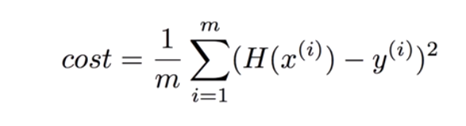
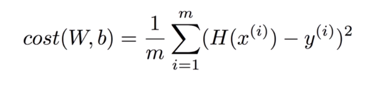

<hr />
## Supervised Or Unsupervised
ML(Machine Learning)에는 두가지의 학습방법이 있다.<br>
1. Supervised Learning<br>
2. Unsupervised Learning<br>

Supervised Learning은 고양이나 강아지와 같이 Label을 붙일수 있는 사진같은 것들을 학습시키는 것이다.<br>
반면, Label을 붙여줄 수 없는 것들(뉴스, 단어 등등)의 경우 데이터를 보고 스스로 유사한 것들끼리 분류하게 학습하는 것을 Unsupervised Learning이라 한다.<br>
Supervised Learning의 예시는 아래와 같다.<br>
● Image labeling(Label된 이미지들을 학습시켜 구분시키는 것)<br>
● Email spam filter(스팸으로 구분된 메일들을 학습시켜 스팸을 구분하는것)<br>
● Predicting exam score(여태까지의 시험점수와 공부에 사용한 시간을 학습시켜 점수를 예측시키는 것)
<br>
## Dataset
Dataset은 데이터 X = {x1,x2,..,xn}과 Y = {y1,y2,..,yn}을 말하는 것으로, Dataset을 이용해 ML을 통해 Y에 최대한 Prediction을 가깝게 해주는데 사용한다. 쉽게 정리하자면, 학습시킬때 사용할 input과 output정도로 생각해주면 편하다.
<br>
## Types of supervised learning
● 공부 시간에 따른 시험점수 예측(0~100점)<br>
= Regression<br>
● 공부 시간에 따른 합격/불합격 여부<br>
= Binary classification<br>
● 공부 시간에 따른 A,B...F 학점 매기기<br>
= Multi-label classification<br>
<br>
## Hypothesis  & Cost function
A.I를 공부하기에 앞서 가설(Hypothesis)과 비용 함수(Cost Function)에 대한 이해가 필요하다.<br>
Machine Learning은 주어진 데이터 X = {x1,x2,x3,..,xn}와 데이터에 대응하는 실제 현상 Y = {y1,y2,..,yn}에 대한 관계함수 f를 찾는 과정이다. 정확한 함수 f를 찾기 위해 Maching Learning 알고리즘들은 데이터에 대한 가정을 하고, 그 가정에 따라 주어진 데이터를 최대한 잘 설명할 수 있는 함수 ```f′```을 찾고, 이 ```f′```을 Hypothesis라고 한다.<br>
(Hypothesis에 대한 설명 출처: http://sanghyukchun.github.io/57/)
<br><br>
Machine Learning에서 학습을 진행하기 위해서는 모델의 정확도를 측정하고, 예측 값(측정 값)과 실제 값 차이의 평균을 구해야 한다. 이것을 구하는 것이 Cost Function(Loss Function)이다.
<br>
Hypothesis를 함수 H(x)라고 하면, Linear Regression에서의 H(x)는 ```H(x) = Wx + b```가 된다.<br>
Cost Function은 Loss Function이라고도 부르며, 실제 값과 Prediction(예측 값)과의 차이를 제곱하여 평균을 구한것이다(아래 이미지 참고).<br>
<br>
위 사진에서 m = 데이터 갯수를 나타낸다.<br>
함수 H(x)와 Cost함수를 합치면 아래와 같은 식이 나오게된다.<br>
<br>
즉, Linear Regression에서의 ML의 학습이란,  ```cost(W,b)```의 값을 가장 작게 만드는 W와 b를 찾는것이다.