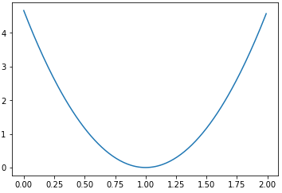
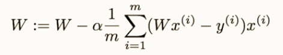

## How to minimize the cost of Linear Regression
Linear Regression의 Hypothesis를 ```H(x) = Wx```라고 단순하게 표현한다고 하자, W를 x축, Cost를 Y축에 나타낸다면 아래와 같은 그래프가 만들어지게 된다.<br>
<br>
우리가 Cost를 최소화 시키기 위해서 Gradient Descent Algorithm을 사용할 것이며, 여기에는 미분이 사용된다.
1. 특정 좌표에서 시작한다<br>
-Weight 값을 계속 변화시키며, bias를 아주 약간 다르게하여 cost(W,b)를 감소시킨다.
2. 파라미터의 값을 변화시킬 때 마다, cost(W,b)를 가능한 가장 많이 줄여주는 순간기울기를 선택한다.
3. 최솟값으로 모일때까지 반복한다.

<br>
위 이미지가 미분한 결과이다. 이미지에서 알파(a)는 Learning Rate를 의미하며, 나중에 문서에서 설명하도록 하겠다.<br><br>그림1을 보면 최적의 W는 1이다. 만약 우리가 위 공식을 이용해서 최적의 1의 값을 찾는다고 하면, W가 4.0에서 시작했다면 W의 값이 왼쪽(감소)으로 가야한다. 이 과정의 반복을 통해 최적의 W를 찾아낼 수 있는 것이다!<br><br>이처럼 W를 다시 찾는다고 하면 어느 방향으로 이동하는지가 중요한 관건이지만, Tensorflow에서는 함수가 알아서 편리하게 계산해준다 XD.<br>
여튼 요약하자면 공식은 아래와 같이 정리된다<br>
```W = W - learning_rate * 순간기울기```<br>
추가로 Convex Function도 확인하고 사용해줘야 한다.<br>
<br>
이미지 출처: http://www.holehouse.org/mlclass
<br>
위 이미지가 Convex Function이라는 것인데, X축은 W, Y축은 b, Z축은 cost를 나타내는 것이다. 위에서 보면 두개의 다른 좌표에서 시작하여 Gradient Descent Algorithm을 실행 했지만, 다른 좌표에 도착한게 된다. 따라서 정확한 값을 얻지 못한다는 말이다.<br>
<br>
이미지 출처: http://www.holehouse.org/mlclass<br>
위에서 보이는 그림이 바람직한 Convex Function의 그림이다.