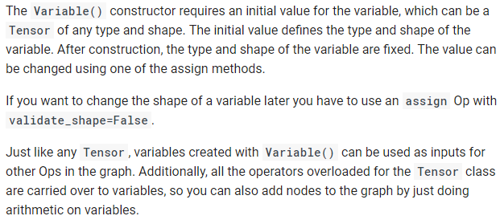
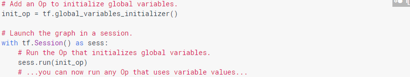

<hr/>
## Tensorflow 주요 함수 정리
* 본 포스팅은 Tensorflow API r1.8를 기준으로 작성되었습니다.
* ```import tensorflow as tf``` 즉, tf에 tensorflow를 import했다는 가정에서 설명하겠습니다.
* 지속적으로 업데이트할 문서입니다. 첫 게시일은 18/07/05 입니다.


1. tf.Variable()<br>
Tensorflow에서 변수를 생성할때 사용하는 함수.<br><br>
공식 API에서 설명하는 함수는 아래와 같다.<br>
<br><br>
"Variable()은 변수에 사용할 초기값을 요구합니다. 이 변수는 텐서의 어떤 타입이나 형태가 될수있습니다. 초기값은 변수의 형태와 타입을 정의합니다. 해당 함수를 사용한후, 변수의 타입과 형태는 고정됩니다. 이 값은 assign메서드를 사용해서 변경가능합니다.<br><br>만약 나중에 변수의 형태를 바꾸고싶다면, ``validate_shape=False``와 ```assign``` Op를 사용해야합니다.<br><br>``Tensor``나``Variable()``로 생성된 것들은 그래프에서 다른 Op의 input으로 사용할 수 있습니다. 추가로, ``Tensor``class로 오버로드 되는 모든 Operator들은 변수로 넘겨집니다. 그래서 변수의 산술연산만으로 그래프에 노드를 추가할 수 있습니다."<br><br>
```w = tf.Variable(<initial-value>, name=<optional-name>```<br>
tf.Variable(초기값, name=\"optional name\")<br>
name은 말그대로 optional한 부분이기 때문에 굳이 적어주지 않아도 된다.<br>
<br>
공식 API에서는 그래프를 실행할 때, 변수는 그 값을 사용하는 ops를 실행하기 전에 명시적으로 초기화해야 한다고 적혀있다. 그래서 위의 이미지와 같이 모든 변수를 초기화 할 그래프에 ```initialize_all_variables()```로 Op를 추가한다. 그후 그래프를 실행하고 Op를 실행한다.

###### API문서 해석하고 찾아보니까 해석본이 이미 있었다.
######---- 18.07.05 까지 내용 ----

